## 仿真环境搭建

### 1.下载虚拟机

首先，打开VMware虚拟机官网

https://www.vmware.com/cn/products/workstation-pro.html
点击下载，并按照其安装流程一步一步安装，没有难点。

下载好之后，桌面显示如下图标，双击即可运行

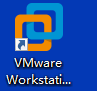

下载比赛官方提供的ubuntu系统镜像压缩包，文件名为VMware-ubuntu1604-ros-kinetic-镜像

拷贝之后，双击打开文件夹，会发现如下的7z压缩文件。

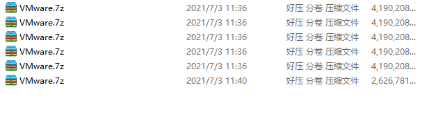

此时，可以使用2345好压软件（若能直接解压则忽略）对7z文件解压。

解压完成之后，打开VMware软件，选择-文件-打开，找到刚才的解压文件即可。

开机密码121

若虚拟机Ubuntu系统开机时，VMware提示：已将虚拟机配置成16个CPU运行，但主机只有8个CPU，此时关闭ubuntu虚拟机，并选择unbuntu64位选项卡，双击设备下的处理器，并将16改为8。如下图所示：

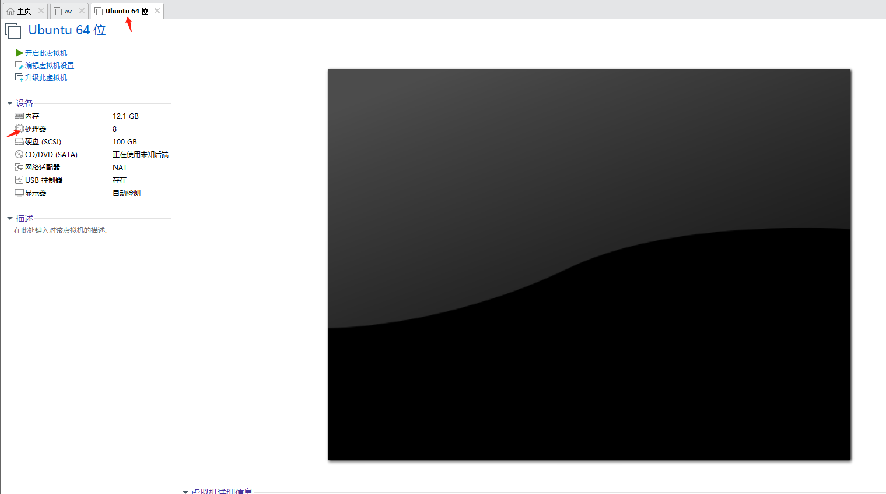

### 2.更新	Botec-Roban-Sim程序文件

打开终端

再输入cd sys_update

再输入git fetch

再输入git pull origin fan_ubuntu

再输入git checkout fan_ubuntu

然后运行./update.sh

选择01开始更新程序，若更新失败，重新选择01再更新程序。


## 运行比赛程序
### 1.选手应当在robot_ros_application/catkin_ws/src/Botec_Roban_Sim/player_scipts文件夹中修改自己的代码，提交比赛代码时应将此文件夹打包发送给比赛方邮箱：botec2021@126.com

在该文件夹中已经包含有demo.py例程以供参考。参赛选手可以阅读该例程完成比赛任务。

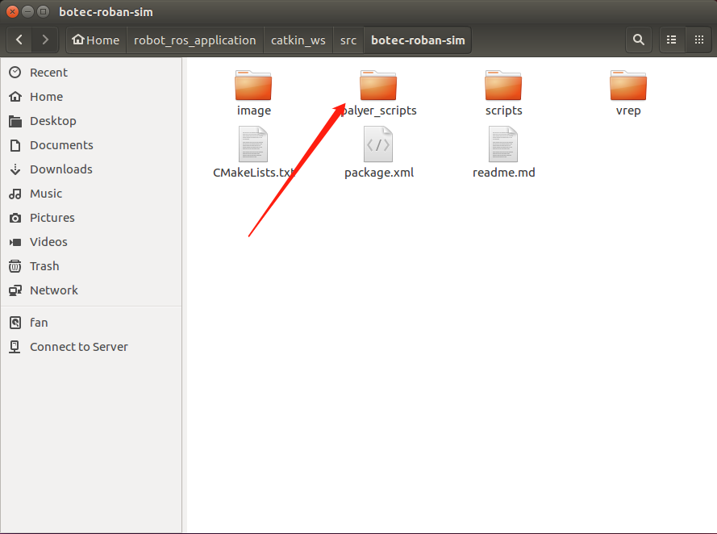

如下图所示：

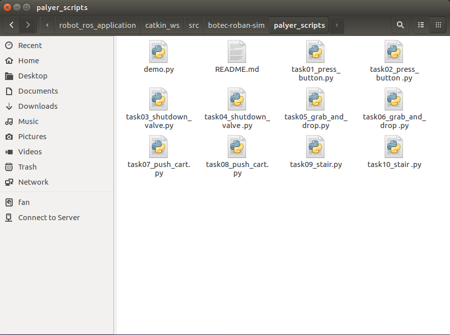

task01_press_button.py为任务一——关闭电源的代码

task02_press_button.py为任务二——视觉引导关闭电源的代码，以此类推。

选手应该在保持文件名称和路径不变的情况下编写相应关卡的文件代码，并进行仿真测试。
### 2.启动vrep及开始仿真

打开终端

输入启动代码：python /home/fan/robot_ros_application/catkin_ws/src/Botec_Roban_Sim/scripts/auto_run/complete_tool.py 

依据提示输入关卡1~10将会相应的运行选手代码。并开始计时，当完成比赛任务后计时停止。最终会显示花费时长。

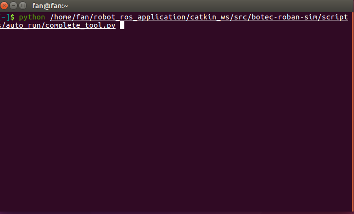

按下Enter后提示输入关卡，如下图所示：

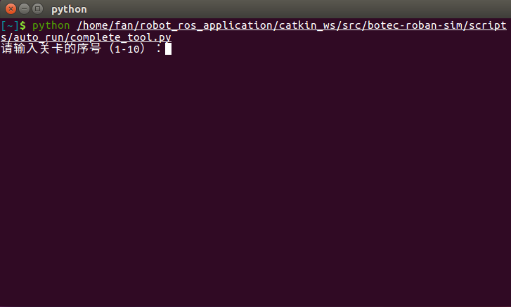

以第一关举例，输入1+Enter，如下图所示：

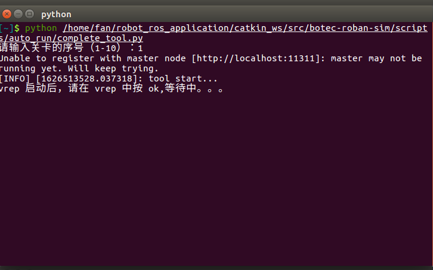

然后自动启动V-rep，若出现如下图的弹窗（若未出现直接执行下一步）：

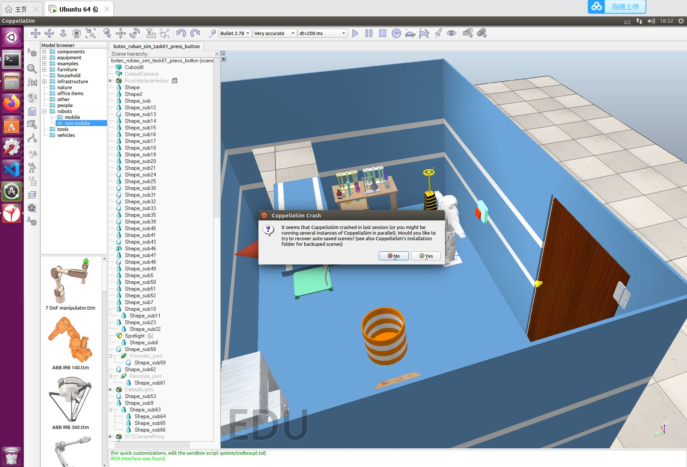

点击NO，显示如下：

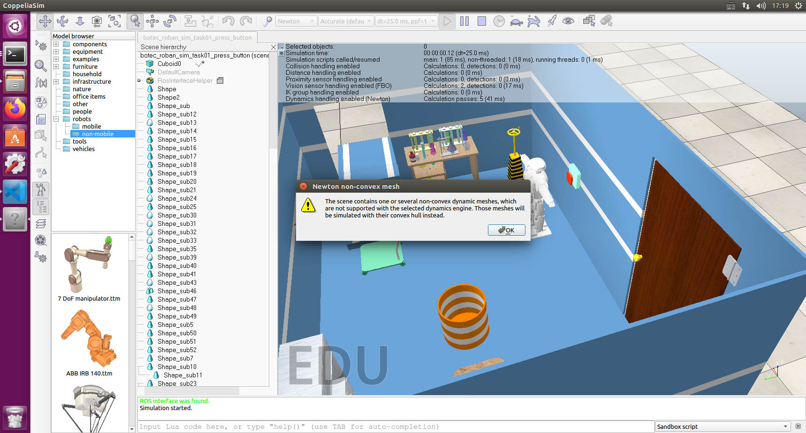

点击OK之后，稍等一会儿编写的第一关的python程序才会运行，显示如下：

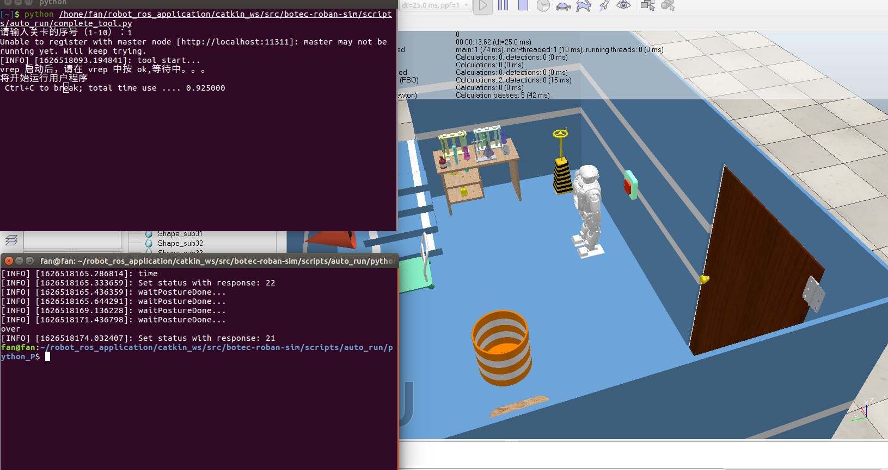

待启动代码的终端的时间停止计时后，按键Ctrl+C中断，并且按q+Enter关闭V-rep及所有节点，最终结束后如下所示：

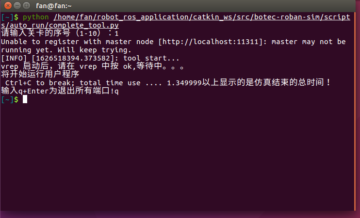

### 3.python中显示Roban随机位置的信息
此示例仅用任务2举例，打开终端输入启动代码：python /home/fan/robot_ros_application/catkin_ws/src/Botec_Roban_Sim/scripts/auto_run/complete_tool.py，选择第0关，并按回车确认。

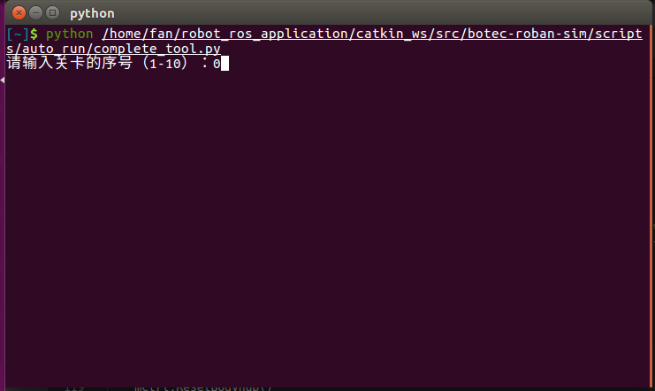

待V-rep启动后，点击ok稍等片刻即可看到Roban的位置信息。

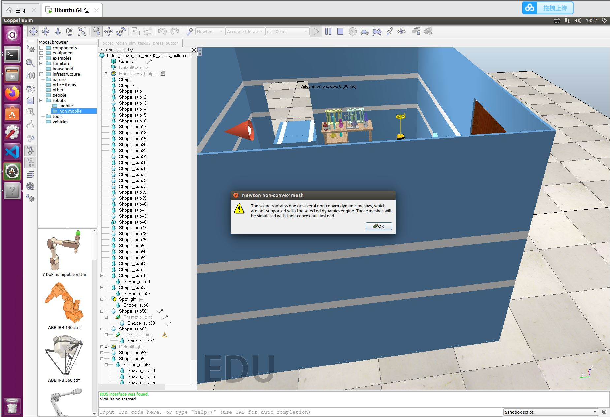

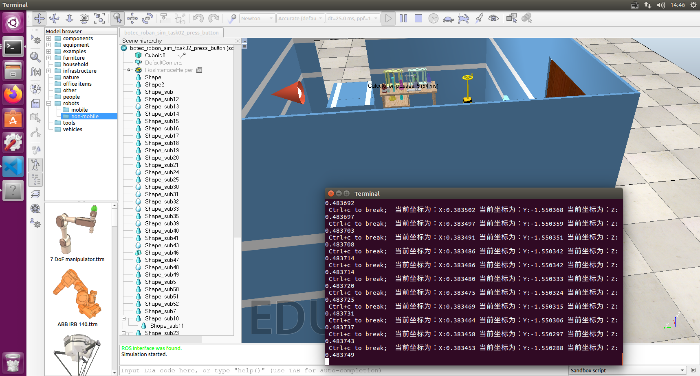


那是在python中如何实现接收位置信息的呢？

此时，打开文件，根据这一路径：/home/fan/robot_ros_application/catkin_ws/src/Botec_Roban_Sim/player_scripts/demo.py  找到demo.py，并用VScode打开，打开后如下图所示：

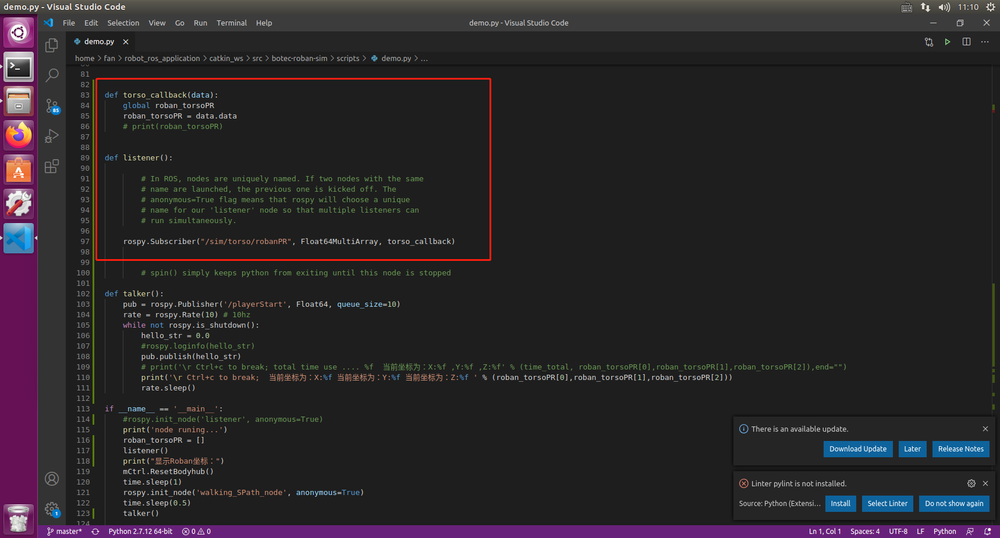

其中是编写一个listener()函数接收信息的，具体python中怎么编写listener()和talker()的，请查看以下链接：http://wiki.ros.org/rospy_tutorials/Tutorials/WritingPublisherSubscriber#Writing_the_Subscriber_Node

解释一下代码，所谓listener()其实是订阅一个subscriber，那么这个subscriber如果要接收到来自V-rep的信息，那么所需的节点和信息类型就要和publisher的节点和信息类型匹配，之后接收到信息后调用回调函数。而在V-rep中关于roban位置信息的topic为/sim/torso/robanPR，它的信息类型为std_msgs/Float64MultiArray


获取机器人当前的位置姿态后，可以规划机器人行走到指定位置然后完成关卡。


## 比赛场景介绍

### 任务 1:

关闭电源: 机器人位于实验室中的固定位置，对应按钮在机器人手臂的工作空间中， 可直接通过运动规划手臂完成任务。

### 任务 2: 

视觉引导关闭电源: 机器人位于实验室中开关附近的随机位置，对应按钮在不处于机器人手臂的工作空间中，但是处于摄像头的视觉范围内，需要先控制机器人行走 (可调用官方提供的步态包)，然后通过运动规划手臂完成任务。

### 任务 3: 

关闭阀门: 机器人位于实验室中的固定位置，对应气体操纵杆在机器人手臂的工作空间中，可直接通过运动规划控制机器人手臂完成任务，其中会有多个气体操纵杆，需要  规划机器人运动时候避免碰到气体操纵杆。

### 任务 4: 

视觉引导关闭阀门: 机器人位于实验室中气体操纵杆附近的随机位置，对应操纵杆在不处于机器人手臂的工作空间中，但是处于摄像头的视觉范围内，需要先控制机器人行  走(可调用官方提供的步态包)，然后通过运动规划控制手臂完成任务。

### 任务 5: 

取走危险化合物: 机器人位于实验室中的固定位置，对应所需抓取的锥形瓶处在手爪的工作，其中会有瓶子的化合物，会指定机器人拿走特定颜色的化合物，在抓取了对应  化合物之后还需要将对应瓶子放到安全桶中。

### 任务 6: 

视觉引导取走危险物: 机器人位于实验室试验台附近随机位置，对应锥形瓶在不处于机器人手臂的工作空间中，但是处于摄像头的视觉范围内，需要先控制机器人行走 (可调用官方提供的步态包)，然后通过运动规划控制手臂抓取对应瓶子，然后通过步行到安全  桶附近将瓶子扔到锥形瓶当中。

### 任务 7: 

推开障碍: 机器人位于实验室中的固定位置，其前方有一辆手推车，机器人可直接推走手推车从而让自身可通过逃生楼梯进入电梯离开，机器人需要推动手推车前进一段距  离，由于手推车附近有一些障碍物，机器人推车时只能在一定范围中将车向前推动，同时  需要推过标志线。

### 任务 8: 

视觉引导推开障碍: 机器人位于实验室推车附近随机位置，其附近有一辆手推车， 但是其不能直接看到手推车，机器人可直接推走手推车从而让自身可通过逃生楼梯进入电梯离开，机器人需要推动手推车前进一段距离，由于手推车附近有一些障碍物，机器人推车时只能在一定范围中将车向前推动，同时需要推过标志线。

### 任务 9: 

上楼梯: 机器人位于实验室的撤离楼梯前，需要登上楼梯并进入安全区域从而撤离撤离现场。

### 任务 10: 

视觉引导上楼梯: 机器人位于实验室的撤离楼梯附近随机位置，但是其可以看到对应的撤离楼梯，机器人需要自行步行到楼梯附近，然后登上楼梯到达撤离区域。

## ik_lib 逆解接口使用介绍

- **ikmodulesim.py**

  class IkModuleSim(object):

  > 封装机器人逆解相关操作，主要使用 toInitPose ， body_motion 和 reset 方法
  
  ```python
  def toInitPoses(self):
      #机器人位姿初始化，在动作执行前调用
      #初始化成功 返回 True ,否则，返回 False
  ```

  ```python
  def body_motion(self, body_pose, value, count=100):
      # 机器人末端动作执行，给定目标位姿 body_pose，value 通过逆解得到舵机角度，控制机器人运动
      Args:
          - body_pose: CtrlType, or [CtrlType] 
              	 表示末端位置，如左/右脚(Lfoot/Rfoot)，身体中心(Torso)
          - value: list, or two dim list. RPY, xyz.
              	 表示给相应末端的位姿值，[r, p, y, x, y, z]
          - count: int. times of division
                   插值次数，缺省为 100
  ```

  ```python
  def reset(self):
      # 动作执行完后的复位，在动作完成后调用
  ```

  使用方法：需从ik_lib中导入 IkModuleSim 和 CtrlType， 然后新建一个类，继承自 IkModuleSim, 然后调用上述方法，完成自定义动作，示例如下：

  ```python
  import math
  import rospy
  from ik_lib.ikmodulesim import IkModuleSim
  from ik_lib.ikmodulesim.CtrlType import CtrlType as C
  
  class ClimbStairs(IkModuleSim):
      def __init__(self):
          super(ClimbStairs, self).__init__()
  
      def climb_stairs(self):
          # 重心下降 4cm
          self.body_motion(C.Torso, [0, 0, 0, 0, 0.0, -0.04])  
          # 重心向左腿偏移 12cm
          self.body_motion(C.Torso_y, 0.12)  
          # 右腿向上移动 5cm
          self.body_motion(C.Rfoot, [0, 0, 0, 0, 0.0, 0.05])  
          # 右腿向前20cm
          self.body_motion([C.Torso, C.Rfoot],
                           [[0, -math.pi / 8, 0, 0.0, 0, 0], 
                            [0, 0, 0, 0.20, 0.0, 0.0]]) 
          # 右腿下2cm
          self.body_motion([C.Torso, C.Rfoot],
                           [[0, math.pi / 8, 0, 0.08, -0.12, 0.0], 
                            [0, 0, 0, 0, 0.0, -0.02]])  
          # 抬左腿1
          self.body_motion([C.Torso, C.Lfoot], 
                           [[math.pi / 8, math.pi / 6, 0, 0.16, -0.10, 0.05],
                            [0, -math.pi / 6, 0, 0.06, 0.0, 0.14]])  
          # 左腿向前20cm
          self.body_motion([C.Torso, C.Lfoot], 
                           [[0.0, -math.pi / 9, 0, -0.04, 0.0, 0.0],
                            [0, math.pi / 6, 0, 0.14, 0.0, -0.05]])  
          # 复原
          self.body_motion([C.Torso, C.Lfoot],
                           [[-math.pi / 8, -math.pi / 18, 0, 0, 0.10, 0.02], 
                            [0, 0, 0, 0.0, 0.0, -0.06]]) 
  
  
  if __name__ == '__main__':
      rospy.init_node('climb_stairs', anonymous=True)
      climb_stairs = ClimbStairs()
  
      def shut_down():
          climb_stairs.reset()
  
      rospy.on_shutdown(shut_down)
  
      # start the simulation once
      if climb_stairs.toInitPoses():
          climb_stairs.climb_stairs()
          climb_stairs.reset()
  ```

  详细可以参考player_scripts/demo.py 示范程序。

  
