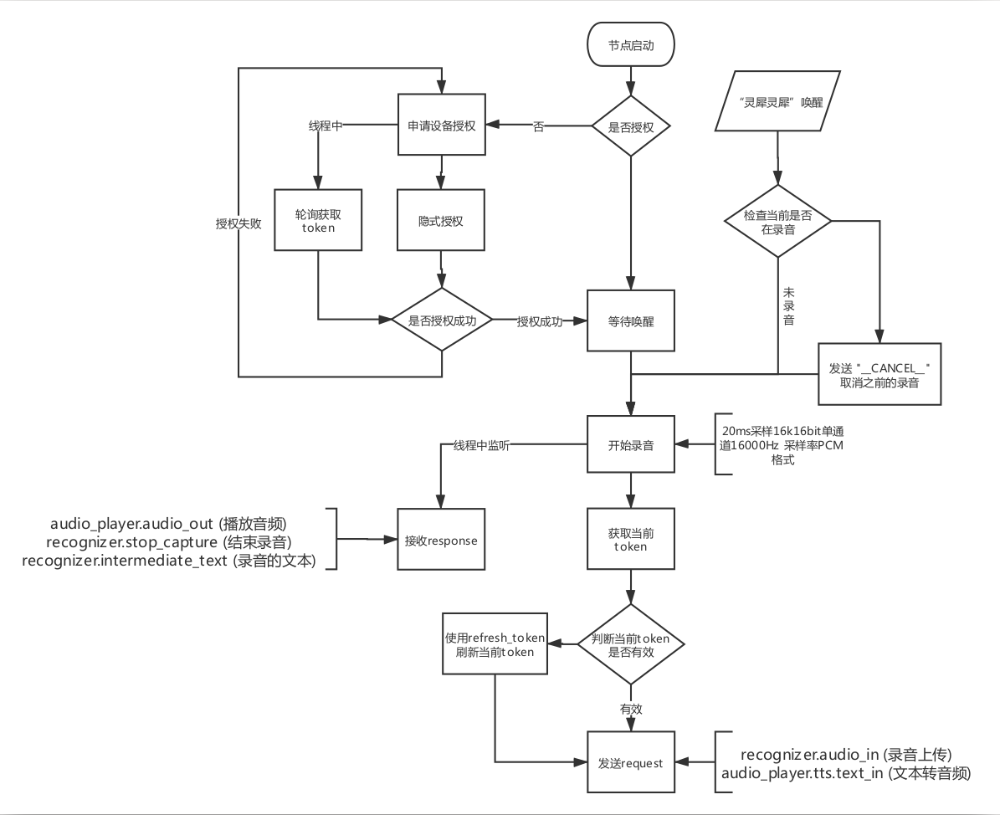

# ros_evs_node 节点使用

## 必备参数

> 当前参数仅仅提供给当前类使用，采用私有类型，故前方加上～

1. ~config_path： /home/lemon/.lejuconfig/iflyos_config.json

参数详情见 launch 文件

## iflyos_config.json 格式

``` json
{
    "client_id": "xxxx",
    "device_id": "xxxx"
}
```
client_id 为讯飞提供的客户端ID

device_id 为当前机器人的设备ID

## 启动节点

`roslaunch ros_evs_node start.launch`


# 讯飞 EVS 流程


大致的流程图如下：




## 授权相关

前期准备：

1. device_id，设备的唯一标识
2. thirdparty_id，三方用户的唯一标识，可以与 device_id 一致
3. client_id，创建的客户端 id

### 申请设备授权

post 请求地址：`https://auth.iflyos.cn/oauth/ivs/device_code`

请求参数：

1. `client_id`：客户端 id
2. `scope`：固定值 `user_ivs_all`
3. `scope_data`: 传入 `device_id` 用，需要使用 url 编码，格式为`{"user_ivs_all": {"device_id": "your device_id"}}`

> 注意：使用 requests 发送 post 请求时，将参数传入 data 或 json 中均无法正确得到结果，最后测试需要将这些参数类似与get请求一样拼接在 url 后才可以。如下：
>
> `https://auth.iflyos.cn/oauth/ivs/device_code?client_id={client_id}&scope=user_ivs_all&scope_data={scope_data}`
>
> 
>
> `scope_data` 需要 url 编码：
>
> ```python
> import sys
> if sys.version_info.major == 2:
>        from urllib import quote
> else:
>        from urllib.parse import quote
> 
> device_id = "xxxxx"
> scope_data = quote('{"user_ivs_all": {"device_id": "' + device_id + '"}}')
> ```


返回参数（json格式，只列举有用的）：

| 参数        | 类型    | 说明                           |
| ----------- | ------- | ------------------------------ |
| user_code   | String  | 简短的`用户授权码`             |
| expires_in  | Integer | `用户授权码`有效时间，单位为秒 |
| device_code | String  | `设备授权码`                   |


### 设备轮询获取 token

post 请求地址：`https://auth.iflyos.cn/oauth/ivs/token`

请求参数(使用 json 传递)：

1. `client_id`：客户端 id
2. `grant_type`：固定值 `urn:ietf:params:oauth:grant-type:device_code`
3. `device_code`：上面获取到的 `device_code`

> 注意，轮询时间使用上面获取到的`expires_in` 


返回的数据可能如下：

返回数据可能是：

- 用户未授权，等待下一次轮循请求

```json
{
    "error": "authorization_pending"
}
```

- 授权码过期，用户仍未授权

```json
{
    "error": "expired_token"
}
```

- 用户通过授权

```json
{
    "token_type": "bearer",
    "refresh_token": "4_vujpFOfu0G5yf4**************DwX5S80s74CY7",
    "expires_in": 86400000,
    "created_at": 1526485197,
    "access_token": "bd6XMEqzIokI6mnMM**************iKAdYNa9T-1WXY"
}
```

| 参数          | 类型   | 说明                            |
| ------------- | ------ | ------------------------------- |
| token_type    | String | 固定值，`bearer`                |
| access_token  | String | 接入`iFLYOS`的令牌              |
| refresh_token | String | 用于刷新AccessToken的令牌       |
| expires_in    | long   | AccessToken的有效时长，单位为秒 |
| created_at    | long   | 令牌创建时间                    |


### 设备隐式授权

post 请求地址：`https://api.iflyos.cn/thirdparty/general/auth`

请求参数：

1. `client_id`：创建的客户端 id
2. `thirdparty_id`：三方用户的唯一标识，可以与 device_id 一致
3. `user_code`：申请设备授权获取到的 `user_code`


返回参数：

| 参数       | 类型   | 说明     |
| ---------- | ------ | -------- |
| token_type | String | 授权成功 |

### 刷新token

post 请求地址：`https://auth.iflyos.cn/oauth/ivs/token`

请求参数：

1. `grant_type`：默认值 `refresh_token`
2. `refresh_token`：上面获取到的 `refresh_token`

返回数据可能是：

- refresh_token无效

```json
{
    "message": "refresh token错误",
    "error": "invalid_refresh_token"
}
```

- 刷新token成功

```json
{
    "token_type": "bearer",
    "refresh_token": "4_vujpFOfu0G5yf4**************DwX5S80s74CY7",
    "expires_in": 86400000,
    "created_at": 1526485197,
    "access_token": "bd6XMEqzIokI6mnMM**************iKAdYNa9T-1WXY"
}
```

刷新成功之后返回数据与获取一致。


## 接入EVS

基本上固定的 `iflyos_header` 和 `iflyos_context`

> 需要注意的是，每次获取 `access_token` 之前需要去判断当前 token 是否过期，过期需要重新获取
>
> 详情看如何 [刷新token](./README.md#刷新token)

```python
request = {
    "iflyos_header": {
        "authorization": "Bearer " + access_token,
        "device": {
            "device_id": device_id,
            "platform": {
                "name": "linux",
                "version": "1604"
            }
        },
    },
    "iflyos_context": {
        "system": {
            "version": "1.3"
        },
        "recognizer": {
            "version": "1.1"
        },
        "speaker": {
            "version": "1.0",
            "volume": 10,
        },
        "audio_player": {
            "version": "1.2",
            "playback": {
                "state": "IDLE",
            }
        },
    },
    "iflyos_request": {
        ...
    }
}
```


### iflyos_request

`iflyos_request` 我们需要使用的请求只有：`recognizer.audio_in`  

`audio_player.tts.text_in` 暂未开通，根据需求待定，暂时无法使用。

#### recognizer.audio_in

`iflyos_request` 中的参数：

```json
"header": {
    "name": "recognizer.audio_in",
    "request_id": "xxxx"
},
"payload": {
    "enable_vad": true,
    "profile": "CLOSE_TALK",
    "format": "AUDIO_L16_RATE_16000_CHANNELS_1",
}
```

| `profile` 取值 | 说明                           |
| -------------- | ------------------------------ |
| CLOSE_TALK     | 近场识别，适合3米内的使用场景  |
| FAR_FIELD      | 远场识别，适合10米内的使用场景 |
| EVALUATE       | 语音评测，适合中英文评测场景   |

`fomat `使用默认值`AUDIO_L16_RATE_16000_CHANNELS_1`，采样的音频文件格式如下：

1. 20ms采样　640 字节
2. 16k16bit单通道
3. 16000Hz采样率
4. PCM格式


> **注意**： request_id 需要商定一个规则，暂定[默认规则](https://doc.iflyos.cn/device/evs/appointment.html#%E5%9F%BA%E7%A1%80%E7%BA%A6%E5%AE%9A)。

## 设备的回复

```json
{
  "iflyos_meta": {},
  "iflyos_responses": []
}
```

#### 通用回复 iflyos_meta

| 参数       | 类型   | 说明                                                         | 必须出现 |
| :--------- | :----- | :----------------------------------------------------------- | :------- |
| trace_id   | String | 本次交互的跟踪标识，提技术支持工单时可能会用到，建议打印在系统日志中 | 是       |
| request_id | String | 本次回复对应的请求的唯一标识，与request中的request_id一致。  | 否       |
| is_last    | Bool   | 标记本次回复是不是这个请求的最后一组回复                     | 是       |

### iflyos_responses

我们需要接收的共３个 `audio_player.audio_out` 、 `recognizer.intermediate_text` 和 `recognizer.stop_capture`

#### audio_player.audio_out

> 音频播放

```json

{
    "header": {
        "name": "audio_player.audio_out"
    },
    "payload": {
        "type": "TTS",
        "url": "http://music.iflyos.cn/tts/sadf.mp3?token=xxxxxxxx",
        "secure_url": "https://music.iflyos.cn/cn/tts/sadf.mp3?token=xxxxxxxx",
        "behavior": "SERIAL",
        "resource_id": "e52e7xxxxxxxxxxxe52e7",
        "metadata": {
            "text": "xxxx"
        }
    }
}
  		
```

| 参数          | 类型   | 说明                                                         |
| :------------ | :----- | :----------------------------------------------------------- |
| type          | String | 播放器类型，我们使用的只有 TTS                               |
| behavior      | String | - SERIAL：串行TTS，执行时阻塞，播完TTS才可以执行下一个指令） <br />- PARALLEL：并行，执行不阻塞，开始播放TTS时可以同时执行后续指令。<br />若该字段未出现，默认为SERIAL |
| url           | String | 内容播放地址                                                 |
| secure_url    | String | 内容播放的安全地址。<br />`url`中可能放的是http的链接，设备解析速度会更快，但有可能会被劫持<br />`secure_url`中放的是不会被劫持的https链接，但设备解析速度可能会相对慢一些 |
| resource_id   | String | 内容ID。                                                     |
| metadata.text | String | 原始文本。                                                   |

#### recognizer.intermediate_text

> 录音转换的实时文本

```json
{
    "header": {
        "name": "recognizer.intermediate_text"
    },
    "payload": {
        "text": "明天的天气怎么样",
        "is_last": false
    }
}
```

| 参数    | 类型   | 说明                                                         |
| :------ | :----- | :----------------------------------------------------------- |
| text    | String | 当前应该显示的文本                                           |
| is_last | Bool   | 是否为最终结果，true表示当前文本为最终结果，false表示当前文本不是最终状态 |

#### recognizer.stop_capture

> 停止录音

```json
{
    "header": {
        "name": "recognizer.stop_capture"
    },
    "payload": {}
}
```

当设备端收到`recognizer.stop_capture`的消息的时候，需要在设备上执行关闭麦克风的操作，关闭后发送 `__END__`来结束音频上传。

在收到`recognizer.stop_capture`前，可以随时通过`__END__`来主动结束语音音频流并等待云端返回结果；

也可以使用 `__CANCEL__`来取消本次语音请求。


## Python 使用 websocket

1. 安装

```bash
pip install websocket_client
```

2. 导入并创建对象

```python
import websocket
ws = websocket.WebSocket()
```

3. 连接讯飞的 iFLYOS

```python
# access_token 使用先前获取的 access_token, 和当前设备的 device_id
ws.connect("wss://ivs.iflyos.cn/embedded/v1?token={}&device_id={}".format(access_token, device_id))
```

4. 发送请求

```python
import json
request_audio = {
    "iflyos_header": {
        "authorization": "Bearer " + access_token,
        "device": {
            "device_id": device_id,
            "platform": {
                "name": "linux",
                "version": "1604"
            }
        },
    },
    "iflyos_context": {
        "system": {
            "version": "1.3"
        },
        "recognizer": {
            "version": "1.1"
        },
        "speaker": {
            "version": "1.0",
            "volume": 10,
        },
        "audio_player": {
            "version": "1.2",
            "playback": {
                "state": "IDLE",
            }
        },
    },
    "iflyos_request": {
        "header": {
            "name": "recognizer.audio_in",
            "request_id": "123456"
        },
        "payload": {
            "enable_vad": True,
            "profile": "CLOSE_TALK",
            "format": "AUDIO_L16_RATE_16000_CHANNELS_1",
        }
    }
}
# 发送请求
ws.send(json.dumps(request_audio))

# 上传音频
binary = open("/home/askeynil/test.pcm", "rb")
ws.send_binary(binary.read())
# 以上方式读取了文件上传，与 20ms 采样违背
# 实际使用的时候应该准确上面录音文件协议进行采样上传。这里仅仅只是 demo 演示如何上传
# 取消录音
# ws.send("__CANCEL__")
# 录音结束
# ws.send("__END__")
```

5. 获取返回结果

```python
# 使用该方法会阻塞当前线程，实际使用中，应将获取返回结果放入一个线程中进行获取
ws.recv_data()

# 该返回结果中存在多种 responses
# 1. recognizer.intermediate_text
# 2. recognizer.stop_capture
# 3. audio_player.audio_out
# 实际使用中需要针对不通的 response 进行相应的处理
```


